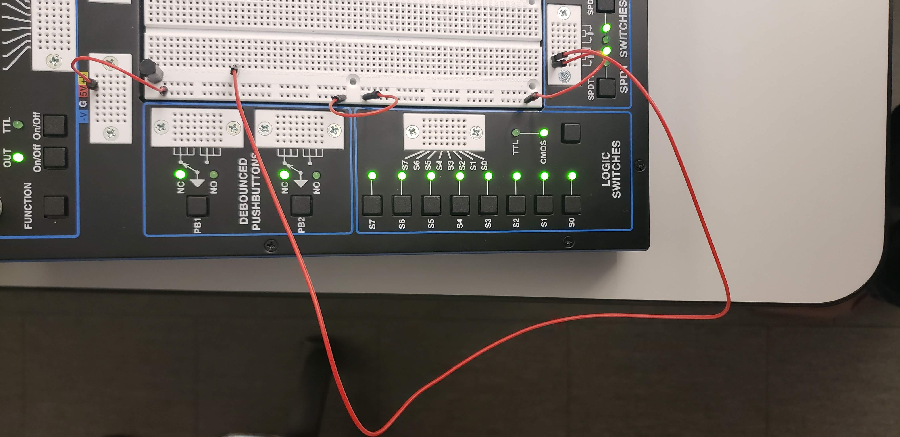

# CPE 1040 - Spring 2020

## Correction Guide for Assignment 5

### Problem

In the [first section](requirements.md#1-npn-transistor-circuit) of the Assignment 5, the requirements state that the base resistor has to be connected to one of the logic switches on the left of the workstation, in the CMOS mode. In the CMOS mode, these switches output 1V in the on state, which is insufficient for the setup shown in the circuit sketch in the requirements.

### Solution 1

Put the switch in the TTL mode (toggle the CMOS-TTL button). With the multimeter, make sure the output voltage in the on position (led is red) is 5V. If not, go to [solution 2](#solution-2).

### Solution 2

Use the SPDT switches on the bottom as shown in the image below. Bring 5V over from the top, making sure to connect the two vertical halves of the rail.

If the image doesn't show, try following [this link](https://photos.app.goo.gl/V5FnHwSvj8XLRz489).
