# CPE 1040 - Fall 2020

This is Learning Progression 005 of the course CPE 1040: Introduction to Computer Engineering at MSU Denver.

Table of Contents
=================

* [CPE 1040 \- Fall 2020](#cpe-1040---fall-2020)
  * [Learning Progression 005: Transistors](#learning-progression-005-transistors)
  * [Lab kit](#lab-kit)
    * [Parts for progression](#parts-for-progression)
  * [Steps](#steps)
    * [Step 1: Transistors](#step-1-transistors)
      * [1\. Study](#1-study)
        * [Semiconductors](#semiconductors)
        * [The diode](#the-diode)
        * [The transistor](#the-transistor)
        * [Field\-effect transistors](#field-effect-transistors)
        * [A note on current direction](#a-note-on-current-direction)
      * [2\. Apply](#2-apply)
      * [3\. Present](#3-present)
    * [Step 2: BJT circuits](#step-2-bjt-circuits)
      * [1\. Study](#1-study-1)
      * [2\. Apply](#2-apply-1)
      * [3\. Present](#3-present-1)
    * [Step 3: Soil sensor](#step-3-soil-sensor)
      * [1\. Study](#1-study-2)
        * [Transistor\-based sensor](#transistor-based-sensor)
        * [Sensing through base resistance](#sensing-through-base-resistance)
      * [2\. Apply](#2-apply-2)
      * [3\. Present](#3-present-2)
    * [Step 4: Manual calibration of soil sensor](#step-4-manual-calibration-of-soil-sensor)
      * [1\. Study](#1-study-3)
      * [2\. Apply](#2-apply-3)
      * [3\. Present](#3-present-3)
    * [Step 5: Automatic calibration of soil sensor](#step-5-automatic-calibration-of-soil-sensor)
      * [1\. Study](#1-study-4)
      * [2\. Apply](#2-apply-4)
      * [3\. Present](#3-present-4)
    * [Step 6: Sensor reading](#step-6-sensor-reading)
      * [1\. Study](#1-study-5)
        * [Reading intervals](#reading-intervals)
        * [Pulse\-width modulation](#pulse-width-modulation)
        * [Non\-linear mapping](#non-linear-mapping)
      * [2\. Apply](#2-apply-5)
      * [3\. Present](#3-present-5)
    * [Step 7: Logic gates out of transistors](#step-7-logic-gates-out-of-transistors)
      * [1\. Study](#1-study-6)
        * [Logical functions](#logical-functions)
        * [Boolean algebra](#boolean-algebra)
        * [Gates out of transistors](#gates-out-of-transistors)
        * [Functional test setup](#functional-test-setup)
      * [2\. Apply](#2-apply-6)
      * [3\. Present](#3-present-6)
    * [Step 8: Half adder and full adder](#step-8-half-adder-and-full-adder)
      * [1\. Study](#1-study-7)
        * [Half adder](#half-adder)
        * [Truth table](#truth-table)
        * [Full adder](#full-adder)
        * [Sum of minterms](#sum-of-minterms)
        * [Minimal number of gates](#minimal-number-of-gates)
      * [2\. Apply](#2-apply-7)
      * [3\. Present](#3-present-7)
    * [Step 9: Simulated logic gates](#step-9-simulated-logic-gates)
      * [1\. Study](#1-study-8)
        * [Booleans revisited](#booleans-revisited)
        * [Order of operatins](#order-of-operatins)
        * [Simulating connections](#simulating-connections)
        * [Functionally complete sets](#functionally-complete-sets)
      * [2\. Apply](#2-apply-8)
      * [3\. Present](#3-present-8)
    * [Step 10: Full adder emulation](#step-10-full-adder-emulation)
      * [1\. Study](#1-study-9)
      * [2\. Apply](#2-apply-9)
      * [3\. Present](#3-present-9)
    * [Step 11: ALU bit slice](#step-11-alu-bit-slice)
      * [1\. Study](#1-study-10)
        * [I/O](#io)
        * [Function selection](#function-selection)
        * [Control lines](#control-lines)
      * [2\. Apply](#2-apply-10)
      * [3\. Present](#3-present-10)
    * [Step 12: Emulated 4\-bit ALU](#step-12-emulated-4-bit-alu)
      * [1\. Study](#1-study-11)
        * [Stacking bit slices](#stacking-bit-slices)
        * [2s complement](#2s-complement)
        * [Overflow](#overflow)
      * [2\. Apply](#2-apply-11)
      * [3\. Present](#3-present-11)


## Learning Progression 005: Transistors
[[toc](#table-of-contents)]  

This progression introduces transistors, the single most important electronic device in the history and present state of computing. The transistor is a 3-terminal semiconductor device which acts like an electronic switch, allowing the design of both processing and memory devices. Modern processors and memories each contain millions of transistors, packed into ever smaller areas of silicon. The progression shows how logic gates are created out of combinations of transistors. It also shows how a single transistor can server as a moisture sensor when cleverly connected. Last but not least, it continues the micro:bit I/O theme.

## Lab kit
[[toc](#table-of-contents)]  

The lab kit is described in detail in a [separate page](lab-kit.md). Please, make sure you read the care and safety instructions embedded for most of the kit components.    

### Parts for progression  
[[toc](#table-of-contents)]  

1. Breadboard.  
2. Breadboard power supply with wall plug.  
3. micro:bit breakout board (connector).  
4. 330 Ohm resistors.  
5. 10 kOhm resistors.  
6. 2N3904 (NPN) transistors.  
7. 2N3906 (PNP) transistors.  
8. LEDs.  
9. Wires.  
10. Multimeter with needle-tipped probes.  

## Steps
[[toc](#table-of-contents)]

### Step 1: Transistors  
[[toc](#table-of-contents)]

#### 1. Study
[[toc](#table-of-contents)]

_Note: Watching the videos referenced at the begging of sections is the best way to understand this material. In some cases, there may be multiple videos that cover the same material, to give you extra depth. The text below briefly covers the main points, without going into detail._

##### Semiconductors
[[toc](#table-of-contents)]  

`[<lernact-see>]`Video of [semiconductor operation](https://www.youtube.com/watch?v=33vbFFFn04k) by [Ben Eater](https://eater.net/).    

`[<lernact-rd>]``[<cept>]`_Semiconductors_ are materials which occupy a middle ground between metals (conductors) and dielectrics, in terms of their `[<cept>]`_conductivity_ of electrical current.
 
Semiconductors are usually pure `[<cept>]`_chemical elements_ (like silicon, Si) which have been `[<cept>]`_doped_, that is, to which a small amount of another element has been added, to create a cumulative excess of free electrons (e.g. phosphorus, P), thus charging the material negative (`[<cept>]`_n-doping_), or a cumulative dearth of free electrons (e.g. boron, B), thus charging the material positive (`[<cept>]`_p-doping_).
 
When p-doped and n-doped regions are created next to each other, interesting electrical behavior occurs, mostly to do with the properties of the resulting  `[<cept>]`_depletion region_ at the `[<cept>]`_p-n junction_.  

Semiconductor `[<cept>]`_fabrication_ is a complex process. This [booklet](https://www.halbleiter.org/en/) is an accessible first look at the different steps.  

##### The diode
[[toc](#table-of-contents)]  

`[<lernact-see>]`Video of [bipolar diode operation](https://www.youtube.com/watch?v=-SSkjWuUri4).  

`[<lernact-rd>]`Diodes are elements which conduct current in only one direction. The simplest diodes are just PN junctions. The N side is called a `[<cept>]`_cathode_, while the P side is called the `[<cept>]`_anode_. When positive voltage is applied from cathode to anode, that is  + NP -, the excess electrons in the cathode region are attracted to the positive voltage terminal, drawing away from the center region of the diode. Similarly, the excess of holes (that is, the dearth of electrons) are attracted to the negative terminal, also drawing away from the center region. As a result, the depletion region, which is the center area where excess electrons recombine with excess holes to make the region electrically neutral, grows and prevents the flow of current through the diode. When voltage is applied in the opposite direction, that is - NP +, the depletion region shrinks or disappears completely, and current can flow.

##### The transistor
[[toc](#table-of-contents)]  

`[<lernact-see>]`Video of [transistor operation](https://www.youtube.com/watch?v=DXvAlwMAxiA) by [Ben Eater](https://eater.net/).  
`[<lernact-see>]`Video of [transistor operation](https://www.youtube.com/watch?v=7ukDKVHnac4).  
`[<lernact-see>]`Video of [NPN and PNP transistor operation](https://www.youtube.com/watch?v=R0Uy4EL4xWs).  

`[<lernact-rd>]`Transistors:
1. Are active circuit elements.   
2. Have 3 terminals.  
3. Use either current or voltage to control a larger current.   
4. Act as switches.  

We will exclusively focus on the so-called `[<cept>]`_bipolar-junction transistors (BJTs)_, which are either a thin N-doped region sandwiched between two thicker P-doped regions (PNP transistor), or a thin P-doped region sandwiched between two thicker N-doped regions (NPN transistor). The middle region is called the `[<cept>]`_base (B)_ and is the one which controls the current between the two outer regions, the `[<cept>]`_emitter (E)_ and the `[<cept>]`_collector (C)_. When the voltage difference between the base and emitter becomes 0.7 V, base current starts to flow, as a result of which a much larger collector current starts to flow also. Thus, BJTs are current amplifiers. 

For the NPN transistor, V<sub>BE</sub> = + 0.7 V and the base current flows out of the base. For the PNP transistor, V<sub>BE</sub> = - 0.7 V (or V<sub>EB</sub> = + 0.7 V) and the base current flows into the base.

Sparkfun has an excellent, accessible thought thorough, [introduction to transistors](https://learn.sparkfun.com/tutorials/transistors) tutorial that is highly recommended for getting a deeper understanding of these simple devices as well as a survey of their wide array of applications.  

##### Field-effect transistors
[[toc](#table-of-contents)]  


`[<lernact-see>]`Video of [MOSFET operation](https://www.youtube.com/watch?v=stM8dgcY1CA).  

`[<lernact-rd>]`As opposed to BJTs, `[<cept>]`_field-effect transistors (FETs)_ do not have base current. Instead, they employ variable voltage applied to the `[<cept>]`_gate_ terminal (analagous to the base in BJTs) to shrink or expand the conducting region between the other two terminals, the `[<cept>]`_source_ (analogous to the emitter in BJTs) and the `[<cept>]`_drain_ (analogous to the collector in BJTs).

##### A note on current direction
[[toc](#table-of-contents)]  

`[<lernact-rd>]`The convention is that `[<cept>]`_positive current_ flows in the direction opposite the flow of the electron charges. It is good practice to check whether a material refers to `[<cept>]`_conventional current_ or not.  

#### 2. Apply
[[toc](#table-of-contents)]

1. `[<lernact-texp>]`If you connect two bipolar junction diodes in series, either in PN-NP or NP-PN configuration, and connect a wire between them to act as the base, can you make a PNP or NPN transistor? Why or why not?  

2. `[<lernact-disc>]`BJT transistors use their base current to control the main circuit current, whereas FET transistors only use voltage and have no base current. Which of the two types would you think more likely to be the choice for the production of integrated circuits (like processors and memory sticks), where transistors are packed very densely and close to each other?  

3. `[<lernact-disc>]`**[Optional challenge, max 10 extra step points]** This progression will focus on processing but we know that memory is no less important. In this discovery exercise, read an [article](https://en.wikipedia.org/wiki/Static_random-access_memory) and watch a [video](https://www.youtube.com/watch?v=GBL28_Tw6UQ) on the structure and operation of a 1-bit `[<cept>]`_SRAM cell_, which is usually built out of 6 `[<cept>]`[_MOSFETs_](https://en.wikipedia.org/wiki/MOSFET). SRAM is the current technology for computer main memory (aka RAM). Here are some guiding questions:
   1. What is `[<cept>]`_bistability_ and why is it important for memory?  
   2. What is memory anyway?  
   3. What are the bit lines?  
   4. What is the word line?  
   5. Why are MOSFETs used rather than, say, BJTs?

4. `[<lernact-disc>]`**[Optional challenge, max 10 extra step points]** Processors and memory are the fundamental devices of computing. There is a constant urge to pack more and more transistors closer and closer together to get larger capacities in smaller packages. How are transistor density and the `[<cept>]`_dark silicon_ problem related?  

#### 3. Present
[[toc](#table-of-contents)]

In the [Lab Notebook](README.md):

1. Answer the questions in 1.2.1. Show your work in well-formatted Markdown, including whatever images, tables, or other graphical elements you find necessary.  
2. Answer the question in 1.2.2. Show your work in well-formatted Markdown, including whatever images, tables, or other graphical elements you find necessary.  
1. Explain the structure and operation of SRAM cells and answer the questions in 1.2.3. Show your work in well-formatted Markdown, including whatever images, tables, or other graphical elements you find necessary.  
1. Answer the questions in 1.2.4. Show your work in well-formatted Markdown, including whatever images, tables, or other graphical elements you find necessary.  


### Step 2: BJT circuits
[[toc](#table-of-contents)]

#### 1. Study
[[toc](#table-of-contents)]

`[<lernact-see>]`Video of [NPN and PNP Transistors as `[<cept>]`_common-emitter switches_](https://www.youtube.com/watch?v=kNVaIqmKUoI)

`[<lernact-rd>]`Our kit has 4 NPN and 4 PNP transistors, also LEDs and resistors. We'll use a single NPN transistor, and LED, a 330 Ohm resistor, and a 10 kOhm resistor to build our first transistor circuit. It will use a micro:bit output pin, digital or analog, to drive the circuit. In particular:
1. The transistor base will be connected _through a large resistor of 10 kOhms_ to the micro:bit pin. The resistor makes sure that the `[<cept>]`_base current_ is very low. Larger current will damage the transistor.  
2. The NPN transistor is a `[<cept>]`_current amplifier_, meaning that a small base current allows a much larger collector current to flow.  
3. The LED is connected _through a small resistor of 330 Ohms_ to the 3.3V power pin of the micro:bit and the collector of the NPN transistor. The resistor again limits the size of the current that flows through the LED, protecting it from damage. This part of the circuit is usually known as the `[<cept>]`_load circuit_, in the sense that this is what the transistor is turning on and off.  
4. Both the base current and the collector current flow into the emitter. So there are two closed loops of our circuit:  
   1. The base loop is 3.3V -- switch (via pin on/off) -- 10 kOhm resistor -- transistor base -- transistor emitter -- ground (GND pin of the micro:bit).  
   2. The collector loop is 3.3V -- 330 Ohm resistor -- transistor collector -- transistor emitter -- ground (GND pin of the micro:bit).  

Take a look at the following sketch:

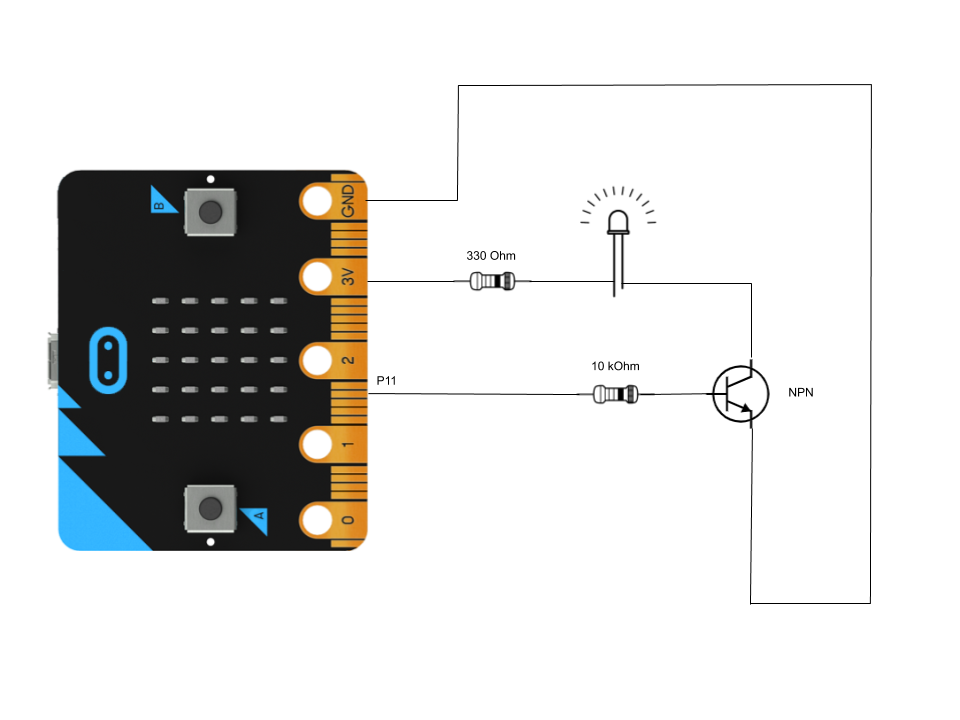

Note the following:
1. The micro:bit image in the sketch is without the connector, which has the pins in order.  
2. The pins used a 3.3V, GND, and P11.  
3. It matters how the LED and transistor are connected:  
   1. For the LED, always connect the longer leg toward power (3.3V) and the shorter toward ground (GND).  
   2. For the NPN transistor, read the [2N3904 datasheet](https://www.sparkfun.com/datasheets/Components/2N3904.pdf) to identify the base, collector, and emitter pins. The curved semi-cylindrical package makes this easy.    
4. The circuit operation can be seen in [this short video](https://msudenver.yuja.com/V/Video?v=2191285&node=8088986&a=1353912353&autoplay=1).  

#### 2. Apply
[[toc](#table-of-contents)]

1. `[<lernact-prac>]`Build the NPN circuit from the sketch and videos. Run P11 as `digitalWritePin`. Measure the following, in to different states: 
   1. With P11 **on** (that is, outputing logical 1 or approximately 3.3V):  
      1. The voltage between the 330 Ohm resistor and the LED. Calculate the voltage drop V<sub>R330</sub> across the resistor.  
      2. The voltage between the LED and the transistor collector. This is V<sub>C</sub>. Calculate the voltage drop V<sub>LED</sub> across the LED. Does it match the specification in the LED package in the lab kit?  
      3. The collector current I<sub>C</sub> flowing through the load circuit. Calculate the resistance of the LED.  
      4. The voltage between the 10 kOhm resistor and the transistor base. This is V<sub>B</sub>. Calculate:
         1. The voltage drop V<sub>R10K</sub> across the resistor.  
         2. The voltage V<sub>CB</sub> between the collector and base.  
         3. The voltage V<sub>CE</sub> between the collector and emitter.  
         4. The voltage V<sub>BE</sub> between the base and emitter. Is it what you expected from your knowledge of BJTs?        
      5. The base current I<sub>B</sub> flowing across the base resistor. Calculate the current amplification factor I<sub>C</sub>/I<sub>B</sub>.  
      6. The emitter current I<sub>E</sub> flowing through the common segment of the two closed loops of the circuit. Does _common emitter_ ring a bell? What is the relationship of the three currents I<sub>C</sub>, I<sub>B</sub>, I<sub>E</sub>? Is is what you expected from your knowledge of BJTs?  
   2. With P11 **off** (that is, outputing logical 0 or approximately 0.0V): 
      1. V<sub>C</sub>.  
      2. V<sub>B</sub>.  
      3. V<sub>E</sub>. Calculate V<sub>BE</sub>. Is it what you expected from your knowledge of BJTs?    

2. `[<lernact-prac>]`In the same circuit, run P11 as an `analogWritePin` with levels in the whole range [0, 1023]. Identify at what output level P11 turns on the LED (that is, the LED is visibly shining). For this level, what is the actual voltage at the pin?  

3. `[<lernact-prac>]`Where else can the load circuit be connected in the circuit without significantly changing the overall behavior?  

4. `[<lernact-prac>]`**[Optional challenge, max 7 extra step points]** Build the PNP circuit from the first video and perform the corresponding measurements as in 2.1.1. Refer to the [2N3906 datasheet](https://www.sparkfun.com/datasheets/Components/2N3906.pdf) for the terminal identification.    

5. `[<lernact-prac>]`**[Optional challenge, max 7 extra step points]** Build and simulate the circuit from 2.2.1 in the [CircuitJS simulator](http://lushprojects.com/circuitjs/circuitjs.html). Use a switch in place of the micro:bit pin.      

#### 3. Present
[[toc](#table-of-contents)]

In the [programs](programs) directory:

1. Add your program from 2.2.1 with filename `microbit-program-2-2-1.js`.  
2. Add your program from 2.2.2 with filename `microbit-program-2-2-2.js`.  
3. Add your program from 2.2.4 with filename `microbit-program-2-2-4.js`.  

In the [Lab Notebook](README.md):

1. Show all your measurements from 2.1.1.  
2. Link to the program from 2.2.1.  
3. Link to a demo video of the operation of the program from 2.2.1.  
4. Show all your measurements from 2.1.2.  
5. Link to the program from 2.2.2.  
6. Link to a demo video of the operation of the program from 2.2.2.  
7. Show your work from 2.2.3.  
8. Link to the program from 2.2.4.  
9. Link to a demo video of the operation of the program from 2.2.4.  
10. Show all your measurements from 2.1.4.  
11. Record a video of the circuit from 2.2.5 operating in the simulator with V<sub>B</sub> and V<sub>C</sub> shown in scopes and switch open and closed.  
 

### Step 3: Soil sensor  
[[toc](#table-of-contents)]

#### 1. Study
[[toc](#table-of-contents)]

##### Transistor-based sensor
[[toc](#table-of-contents)]  

`[<lernact-rd>]`The next several steps will focus on an extremely simple application of a transistor: a soil moisture sensor. Here is a closeup:  

Sensor front | Sensor back
--- | ---
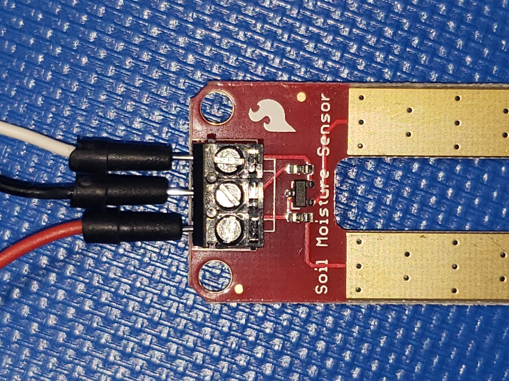 | 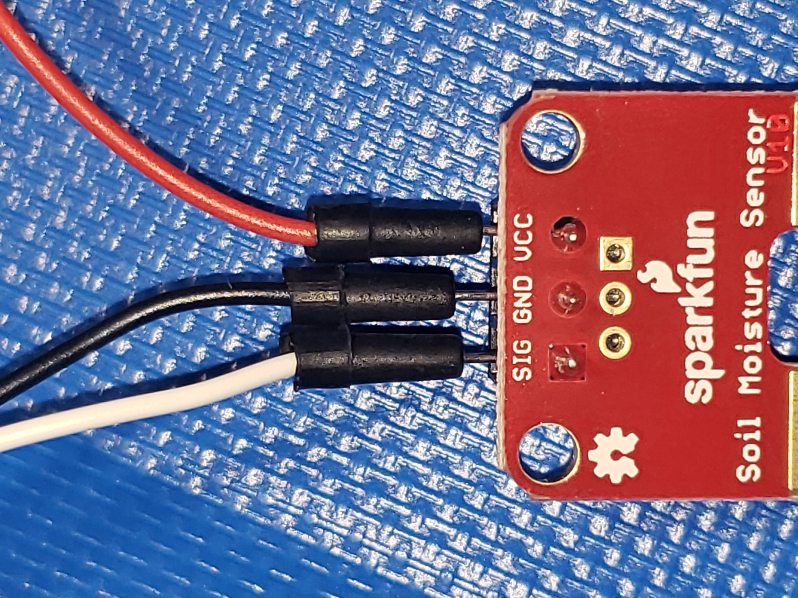  

Notice the following:
1. On the front, the tiny transistor, which is at the heart of the sensor.  
2. On both sides of the transistor, there are two resistors.  
3. There are three electrical connections: V<sub>CC</sub>, GND, and SIG. The latter is an input signal for the micro:bit.  

This is a Sparkfun sensor, so their [guide](https://learn.sparkfun.com/tutorials/soil-moisture-sensor-hookup-guide) is the best introduction. Note that the code is for a different board.  

##### Sensing through base resistance
[[toc](#table-of-contents)]  

Let's examine the `[<cept>]`_schematic_ of the sensor to understand exaclty how it works:


Notice the following:
1. The transistor is the familiar NPN 2N3904.  
2. The two prongs, when connected through a resisting medium (say, water) form a high-resistance _base resistor_. Remember that the base current regulates the collector current. By Ohm's law, holding the input voltage the same (in this case ~3.3V) and varying the base resistance will vary the base current, which in turn will vary the collector current. This is the key to the operation of the sensor. When the sensor's prongs are dipped in water, the water has some resistance, but enough to conduct the base current and open the collector-emitter current channel. When the soil is taken out of any conducting medium, the resistance between the prongs is very large (near infinite) and there is no base current to activate the collector current.  
3. Finally, the signal is read at the transistor emitter, across a 10 kOhm resistor from ground. The reading is as follows:
   1. When the base has non-infinite resistance, base current flows, and so collector current flows, the voltage at the signal reading point is close to V<sub>CC</sub>, since there is only the low transistor resistance to drop the voltage across the collector-emitter junction.  
   2. When the base has near infinite resistance, base current doesn't flow, and so no collector flows either, forcing the voltage at the signal reading point to ground, as no current flows through the emitter resistor to raise the voltage.  

#### 2. Apply
[[toc](#table-of-contents)]

1. `[<lernact-prac>]`Complete the sensor guide, using an analog read pin and displaying the raw readings on the micro:bit screen, as can be seen in this [demo video](https://msudenver.yuja.com/V/Video?v=2190593&node=8087669&a=695880639&autoplay=1).   

2. `[<lernact-prac>]`Try to measure the resistance of water as shown in these images:
   Maximum measurable resistance | Measurement maxed out
   --- | ---
   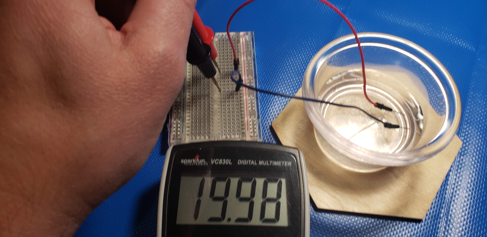 | 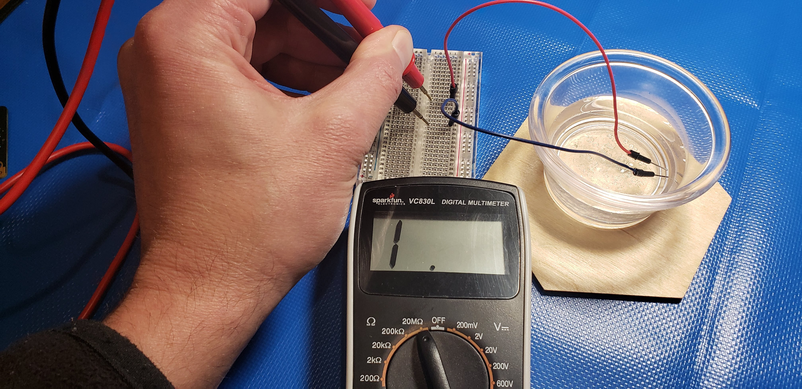 
   
   Do some research to find the resistance of fresh water. Do you expect salt water to have higher or lower resistance?  
   
3. `[<lernact-prac>]`**[Optional challenge, max 3 extra points]** Measure V<sub>B</sub> and V<sub>E</sub> during operation.  

4. `[<lernact-prac>]`**[Optional challenge, max 5 extra points]** Measure I<sub>B</sub> and I<sub>E</sub> during operation. _Be careful._    

5. `[<lernact-prac>]`**[Optional challenge, max 10 extra points]** Draw and simulate the sensor circuit with the [CircuitJS simulator](http://lushprojects.com/circuitjs/circuitjs.html), creating a slider for the base resistance and a scope for the signal reading point.   

#### 3. Present
[[toc](#table-of-contents)]

In the [programs](programs) directory:

1. Add your program from 3.2.1 with filename `microbit-program-3-2-1.js`.  

In the [Lab Notebook](README.md) and the [images](images) directory:

1. Link to the program from 3.2.1.  
2. Link to a demo video of the operation of the program from 3.2.1.  
3. Show all your work for 3.1.2.  
4. Embed an image of your setup and show your measurements from 3.1.3.  
5. Embed an image of your setup and show your measurements from 3.1.4.  
6. Record a video of the circuit from 3.2.5 operating in the simulator with V<sub>SIG</sub> shown in a scope and the R<sub>B</sub> slider moved over its range.  


### Step 4: Manual calibration of soil sensor  
[[toc](#table-of-contents)]

#### 1. Study
[[toc](#table-of-contents)]

`[<lernact-rd>]`We already mentioned analog-to-digital conversion (ADC) in a previous step. The analog signals (e.g. the soil sensor SIG line) that are input to the micro:bit are necessarily passed through an ADC and converted to numbers in the range [0, 1023]. This is an arbitrary range and the numbers don't really mean anything until we `[<cept>]`_calibrate_ them for our purposes. We mostly want to know whether our pot of dirt is dry or moist, not that it is, say, 324.  

#### 2. Apply
[[toc](#table-of-contents)]

1. `[<lernact-prac>]`Calibrate manually the sensor readings and show 5 different levels of moisure as horizontal bars on the micro:bit screen, as can be seen in this [demo video](https://msudenver.yuja.com/V/Video?v=2190790&node=8088057&a=1401135328&autoplay=1). Hints:
   1. Use the `pins.map()` function to map the range of signals from the soil sensor to the range [0, 4] of the height of the bars.  
   2. Take several readings of dry and water each, and use their averages for the input range in `pins.map()`. Do you see any difference in the operation if you use the minimum dry value and the maximum wet value?  
   3. Can you get intermediate readings (say, 2-3 bars)?  

#### 3. Present
[[toc](#table-of-contents)]

In the [programs](programs) directory:

1. Add your program from 4.2.1 with filename `microbit-program-4-2-1.js`.  

In the [Lab Notebook](README.md):

1. Link to the program from 4.2.1.  
2. Link to a demo video of the operation of the program from 4.2.1.  
3. Answer the questions in 4.2.1.  


### Step 5: Automatic calibration of soil sensor
[[toc](#table-of-contents)]

#### 1. Study
[[toc](#table-of-contents)]

`[<lernact-rd>]`Sensors often generate incomprehensible readings, so they have to be couched into an easiliy interpretable calibration process to make sense to the user. In this step we tend to the user experience.

#### 2. Apply
[[toc](#table-of-contents)]

1. `[<lernact-prac>]`Write a program to automatically calibrate the soil sensor, with the manual assistance of the user, as shown in this [demo video](https://msudenver.yuja.com/V/Video?v=2191203&node=8088853&a=1177959818&autoplay=1). Hints:
   1. The calibration should be done only once before continous operation of the sensor.  
   2. The two arrows indicate whether the program is recording a high (wet) or low (dry) reading.   
   3. Note that the reading should be taken while an arrow is showing and the wet or dry condition should not be changed until the arrow disappears. Consider using a loop with pauses that are too short compared to human reaction, as shown here:
      ```javascript
      for (let k=0; k<=300; k++) {
          reading = pins.analogReadPin(SIG)
          pause(10)
      }
      ```

#### 3. Present
[[toc](#table-of-contents)]

In the [programs](programs) directory:

1. Add your program from 5.2.1 with filename `microbit-program-5-2-1.js`.  

In the [Lab Notebook](README.md):

1. Link to the program from 5.2.1.  
2. Link to a demo video of the operation of the program from 5.2.1.  


### Step 6: Sensor reading  
[[toc](#table-of-contents)]

#### 1. Study
[[toc](#table-of-contents)]

`[<lernact-rd>]`While sensors can be calibrated and their data presented to the user coninuously, this may not be ideal for the amount of user attention they resume. It is often better to design the user interface to only alert the user when critical conditions are detected while blending into the background at other times. In this step we will explore how we can do that with the soil sensor, utilizing external LED reading indicators.  

##### Reading intervals
[[toc](#table-of-contents)]  

Let's assume that we have 5 external LEDs and we use the `pins.map()` function. If we pick the LED colors to form a smooth transition along the rainbow sequence, say red-orange-yellow-green-violet, this may be a simple way to achieve the goal of creating an intuitive and inobtrusive reading indicator. 

Since we are using external LEDs, and we are using the mapping function, we need to create a way of refering to the proper LED by index, just like the case for the micro:bit screen bars. The most straightforward way to do that is to create the mapping between indices from the target range to the specific pins we have picked to drive the LEDs is with an array:
```javascript
// Example 6.1.1

let led_pins : DigitalPin[] = [DigitalPin.P0, DigitalPin.P1, DigitalPin.P2, DigitalPin.P5, DigitalPin.P8] 
```

The mapping function `pins.map()` is converting from a source range roughly similar to [0, 1023] to our target range of [0, 4], that is from 1024 numbers to just 5. Consider the following questions:

**Question 5.1.1:** Considering the [density property](http://www.math.com/school/subject2/lessons/S2U2L1DP.html) of real numbers, is it necessary that several different source range numbers are mapped to the same target range number?  
**Question 5.1.2:** Write a program to map numbers in the source range [0, 1023] to the target range [0, 4] and display the result on the micro:bit using `basic.showNumber()`. Is the target range continuous or discrete? That is, do you see real numbers with fractional parts or only integers?  
**Questoin 5.1.3:** Try to use the result from the call `pins.map(r, 0, 1024, 0, 4)`, where `r` is a random number (not necessarily an integer) in the source range, directly as an index in the selector operator of the `led_pins` array, that is `led.pins[pins.map(...)]`. What do you get?  Explain.  
**Question 5.1.4:** How would you modify the result of the `map` function to work as an index?  
**Question 5.1.5:** In the context of these questions, what do you think the `led.plot(x, y)` and `led.unplot(x, y)` functions do to their arguments `x` and `y`?  
##### Pulse-width modulation
[[toc](#table-of-contents)]  

What if we want a continuous moisture indicator, so that we can monitor precisely the process of soil desiccation? There is a very ingenuous way to smoothly vary the power sent to an LED, resulting in a smooth variation of its brightness, called `[<cept>]`_pulse-width modulation_. Here is a code example:
```javascript

// Example 6.1.2

basic.forever(function () {
    for (let i=1; i<40; i++) {
        pins.servoSetPulse(AnalogPin.P0, i*500)  // period 20 ms = 20000 us
        pause(50)
    }
})
```
Run it with a load circuit (330 Ohm + LED) from analog pin `P0`. What is actually happening? Look at the following sketch:


The voltage varies in a very specific manner: every 20 ms, a pulse of 3.3V and duration of 1.5 ms is sent. When the pulses are short, the LED at the pin outputing this signal is dark. As the pulse width grows, so does the brightness of the LED.

##### Non-linear mapping
[[toc](#table-of-contents)]  

What if the biological processes in the soil depend on the moisture content in a `[<cept>]`_non-linear_ way? This may be akin to how the feeling of comfort depends on relative humidity, as shown in the following image:

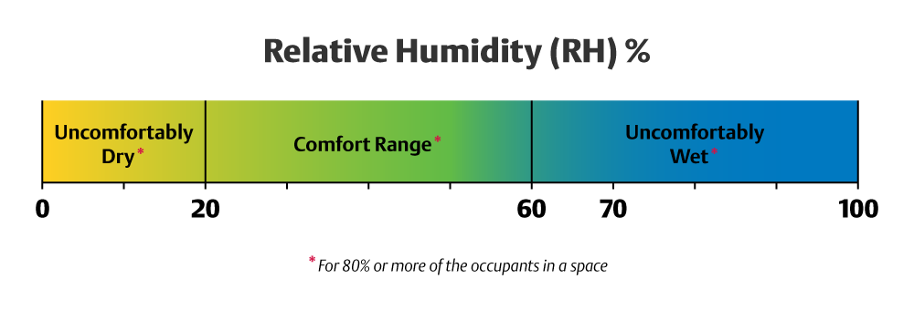

[[Image credit](https://www.ac-heatingconnect.com/homeowners/cold-weather-home-humidity/)]

Then our mapping using `pin.map()` doesn't work because the mapping it performs is `[<cept>]`_linear_, and we need to devise our own intervals and how the correpsond to the display capabilities of our indicator.  

#### 2. Apply
[[toc](#table-of-contents)]

1. `[<lernact-prac>]`Implement the 5-external-LED reading indicator for the soil sensor.  

2. `[<lernact-prac>]`**[Optional challenge, max 5 extra step points]** Implement a reading indicator for the soil sensor using 2 LEDs, one red and one green. Use PWM to vary the brightness of the green LED from high (wetter) to low (drier). Use the red LED to indicate critically dry soil.  

3. `[<lernact-prac>]`**[Optional challenge, max 10 extra step points]** Design a moisture indicator that has the same non-linear dependency on the analog level as the comfort-vs-relative-humidity figure. Write a program. Explain your reasononing and approach.    

#### 3. Present
[[toc](#table-of-contents)]

In the [programs](programs) directory:

1. Add your program from 6.2.1 with filename `microbit-program-6-2-1.js`.  
2. Add your program from 6.2.2 with filename `microbit-program-6-2-2.js`.  
3. Add your program from 6.2.3 with filename `microbit-program-6-2-3.js`.  

In the [Lab Notebook](README.md):

1. Link to the program from 6.2.1.  
2. Link to a demo video of the operation of the program from 6.2.1.  
3. Link to the program from 6.2.2.  
4. Link to a demo video of the operation of the program from 6.2.2.  
5. Link to the program from 6.2.3.  
6. Link to a demo video of the operation of the program from 6.2.3.  
7. Show all your work for 6.2.3.  

### Step 7: Logic gates out of transistors  
[[toc](#table-of-contents)]

#### 1. Study
[[toc](#table-of-contents)]

`[<lernact-rd>]`Perhaps the most impactful application of transistors is in `[<cept>]`_logic gates_, tiny hardware devices which perform `[<cept>]`_logical functions_.  

##### Logical functions
[[toc](#table-of-contents)]  

Logical functions are functions of 1 or 2 1-bit operands, that can take two values, logical 0 (aka `false`) and logical 1 (aka `true`). They are defined in tables for all 4 combinations of the inputs (namely `00`, `01`, `10`, and `11`). The tables are called `[<cept>]`_truth tables_, because they show for which combinations of the inputs the function outputs a 1-bit `true`. Here are the truth tables for the most well known logical functions:

1. Logical function AND (2 inputs, 1 output):
   A | B | A AND B
   --- | --- | ---
   0 | 0 | 0
   0 | 1 | 0
   1 | 0 | 0
   1 | 1 | 1
   
2. Logical function OR (2 inputs, 1 output):
   A | B | A OR B
   --- | --- | ---
   0 | 0 | 0
   0 | 1 | 1
   1 | 0 | 1
   1 | 1 | 1
   
3. Logical function [XOR](https://en.wikipedia.org/wiki/XOR_gate) (meaning `[<cept>]`_exclusive OR_) (2 inputs, 1 output):
   A | B | A XOR B
   --- | --- | ---
   0 | 0 | 0
   0 | 1 | 1
   1 | 0 | 1
   1 | 1 | 0
   
4. Logical function NOT (aka `[<cept>]`_inverter_) (1 input, 1 output):
   A | NOT A
   --- | ---
   0 | 1 | 0
   1 | 0 | 0   

In this progression we show how all computation is built on top of these simple functions.

##### Boolean algebra
[[toc](#table-of-contents)]  

The `[<cept>]`_algebra_ for 2 values, 0 and 1, is called `[<cept>]`[_Boolean Algebra_](https://www.electronics-tutorials.ws/category/boolean). The full coverage of the subject is beyond the scope of this progression, but [this chapter of the material linked above](https://www.electronics-tutorials.ws/boolean/bool_6.html) has a succinct overview of the laws and functions of Boolean algebra, including AND, OR, and NOT.  

`[<lernact-rd>]`The MakeCode [Logic Lab](https://makecode.microbit.org/courses/logic-lab) is a brief and accessible introduction to Boolean logic.  

##### Gates out of transistors
[[toc](#table-of-contents)]  

Logic gates are implementations of the Boolean in `[<cept>]`_hardware_. They are made of tiny combinations of transistors and are extremely fast and can be packed extremely densely on semiconductor chips.  

There are excellent treatments of this topic in online videos and guides, some of which we list here:
1. `[<lernact-see>]`Video on [Logic gates from transistors](https://www.youtube.com/watch?v=sTu3LwpF6XI&t=435s) by Ben Eater.  
2. `[<lernact-see>]`Video on [Logic gates from transistors](https://www.youtube.com/watch?v=SW2Bwc17_wA&t=362s) by Eugene Khutoryansky.  
3. `[<lernact-see>]`Video on [Building logic gates from MOSFET transistors](https://www.youtube.com/watch?v=1rZyGL1K5QI) by EngMicroLectures.  
4. `[<lernact-rd>]`Tutorial on [Building all principal gates out of NPN transistors](https://www.instructables.com/Logic-Gates-with-NPN-transistors/) by Instructables.  
5. `[<lernact-rd>]`Tutorial on [Building an XOR gate out of 6 NPN transistors](http://sullystationtechnologies.com/npnxorgate.html) by Sully Technologies.  

##### Functional test setup
[[toc](#table-of-contents)]  

The following program can be run on the micro:bit to run the external circuits for the logic gates:
```javascript
// Example 7.1.1

function logic(a : DigitalPin, b : DigitalPin) : void {
    let aa : number[] = [0, 1, 0, 1]
    let bb : number[] = [0, 0, 1, 1]

    let brightness : number[] = [5, 255]

    for (let i=0; i<aa.length; i++) {
        led.plotBrightness(0, i, bb[i] ? brightness[1] : brightness[0])
        pins.digitalWritePin(b, bb[i])

        led.plotBrightness(1, i, aa[i] ? brightness[1] : brightness[0])
        pins.digitalWritePin(a, aa[i])

        pause(1000)
    }
    pause(2000)
    basic.clearScreen()
    pins.digitalWritePin(a, 0)
    pins.digitalWritePin(b, 0)
    pause(1000)
}

let a : DigitalPin = DigitalPin.P11
let b : DigitalPin = DigitalPin.P2

basic.forever(function () {
    logic(a, b)
})
```
Notice the following:
1. The program drives 2 operands, `aa` and `bb`. 
2. The operand arrays together form the 4 input combinations for a 2-input logic gate, shown in the first two columns of the micro:bit LED matrix.    
3. The logic function itself is external to the micro:bit, and is built out of NPN transistors and a load circuit.  

Here is a [demo video for logical AND](https://msudenver.yuja.com/V/Video?v=2191928&node=8090055&a=573716934&autoplay=1).  

#### 2. Apply
[[toc](#table-of-contents)]

1. `[<lernact-prac>]`Build an AND logic gate out of NPN transistors and a load circuit, and driven by the micro:bit running the `logic` program. Sketch the design and highlight the current path or lack thereof for:
   1. A logic output of 1 (that is, the LED is lit up). One input combination is sufficient.    
   2. A logic output of 0 (that is, the LED is dark). One input combination is sufficient.   

2. `[<lernact-prac>]`Build an OR logic gate out of NPN transistors and a load circuit, and driven by the micro:bit running the `logic` program. Sketch the design and highlight the current path or lack thereof for:
   1. A logic output of 1 (that is, the LED is lit up). One input combination is sufficient.    
   2. A logic output of 0 (that is, the LED is dark). One input combination is sufficient.   

3. `[<lernact-prac>]`Build an NOT logic gate out of NPN transistors and a load circuit, and driven by the micro:bit running the `logic` program. _You can either modify the program for one operand or use just one of the output pins._ Sketch the design and highlight the current path or lack thereof for:
   1. A logic output of 1 (that is, the LED is lit up). One input combination is sufficient.    
   2. A logic output of 0 (that is, the LED is dark). One input combination is sufficient.   

4. `[<lernact-prac>]`**[Optional challenge, max 15 extra step points]** Build an XOR logic gate out of 2 NPN transistors as shown in the second figure in this [blog post](https://hackaday.io/project/8449-hackaday-ttlers/log/150147-bipolar-xor-gate-with-only-2-transistors), driven by the micro:bit running the `logic` program. Instead of the usual LED load circuit, read the signal at point C with an analog pin, extending the program to match this input with the 4 output combinations for points A and B. Show the output in column 4. What are the analog level ranges for the logic 0 and 1 readings? Sketch the design and highlight the current path or lack thereof for:
   1. A logic output of 1 (that is, the LED is lit up) for both the combinations with this result.    
   2. A logic output of 0 (that is, the LED is dark) for both the combinations with this result.    

5. `[<lernact-prac>]`**[Optional challenge, max 10 extra step points]** Using [CircuitJS simulator](http://lushprojects.com/circuitjs/circuitjs.html), design and simulate the 6-NPN XOR logic gate.  

#### 3. Present
[[toc](#table-of-contents)]

In the [Lab Notebook](README.md):

1. Show your work for 7.2.1.  
2. Show your work for 7.2.2.  
3. Show your work for 7.2.3.  
4. Show all your work for 7.2.4 and answer the question.    
5. Record a video of the circuit from 7.2.5 operating in the simulator with the output reading point shown in a scope while cycling through the 4 input combinations using the two switches.  


### Step 8: Half adder and full adder

#### 1. Study
[[toc](#table-of-contents)]

`[<lernact-rd>]`Logic gates are all we need to build an `[<cept>]`_adder_, a hardware device which can perform addition. We will do this in two steps.  

##### Half adder
[[toc](#table-of-contents)]  

The `[<cept>]`_half adder_ adds two 1-bit numbers but ignores the possible `[<cept>]`_carry in_ from a previous position. The `[<cept>]`_full adder_ adds it in.  

##### Truth table
[[toc](#table-of-contents)]  

The truth table of the half adder, where C<sub>OUT</sub> stands for `[<cept>]`_carry out_ and S stands for sum, is as follows:
A | B | C<sub>OUT</sub> | S
--- | --- | --- | ---
0 | 0 | 0 | 0
0 | 1 | 0 | 1
1 | 0 | 0 | 1
1 | 1 | 1 | 0

Notice the following:
1. This is just plain binary addition of two 1-bit numbers A and B and a 2-bit result C<sub>OUT</sub>S.    
2. C<sub>OUT</sub> = A AND B.  
3. S = A XOR B.  

We already know what gates we need to build a half adder!  

##### Full adder
[[toc](#table-of-contents)]   

The truth table of the full adder has the two inputs A and B and also adds C<sub>in</sub>, the possible carry from the previous position:
A | B | C<sub>IN</sub> | C<sub>OUT</sub> | S
--- | --- | --- | --- | ---
0 | 0 | 0 | 0 | 0 
0 | 0 | 1 | 0 | 1 
0 | 1 | 0 | 0 | 1 
0 | 1 | 1 | 1 | 0 
1 | 0 | 0 | 0 | 1 
1 | 0 | 1 | 1 | 0 
1 | 1 | 0 | 1 | 0 
1 | 1 | 1 | 1 | 1

Notice the following:
1. Again, this is plain addition, this time of 3 1-bit numbers and a 2-bit result.  
2. When we have all 3 inputs equal 1, our result is 3<sub>10</sub>, or 11<sub>2</sub>.  
3. This time, it is not so obvious what C<sub>OUT</sub> and S are equal to in terms of A, B, and C<sub>IN</sub>.  

##### Sum of minterms
[[toc](#table-of-contents)]  

The truth table for the full adder can actually be expressed as 2 equations, one for each of the output bits. Here is the first one, where an input with a bar on top means the input is negated (e.g. ):


What does this all mean? Let's take it apart:
1. C<sub>OUT</sub> is 1 (meaning `true`) when any of the 3-input exressions are 1.    
2. The equations is built out of OR-ed 3-input expressions. The equation can be read as X OR Y OR Z or W.  
3. Each 3-intput expression is composed of 3 AND-ed variables. An expression can be read as U AND S AND T.   
4. The 3-input expressions are called `[<cept>]`_minterms_.  
5. Each minterm expresses an input combination explicitly, with letters (e.g. the row  is expressed as ).  
6. Only the minterms which result in a 1 for the output are used in the expression. The others result in 0 and they don't matter.

##### Minimal number of gates
[[toc](#table-of-contents)]  

The raw minterm expression would be extremely wasteful of gates: 4 3-input AND gates for the minterms and then 1 4-input OR gate. Using the laws of Boolean algebra, as shown in this table, 

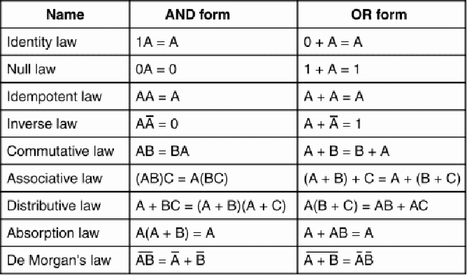  
[[Image credit](http://studytronics.weebly.com/boolean-algebra.html)]  

the expression can be reduced to just a few 2-input gates, as follows:


We need an AND gate, an OR gate, and an XOR gate. 

Note that:
1. The AND gate expression (meaning A AND B) is written as  as a shorthand.  
2. The OR gate expression (meaning A OR B) is written as  as a shorthand.  
3. The XOR gate equation and shorthand symbol are .  

#### 2. Apply
[[toc](#table-of-contents)]

1. `[<lernact-prac>]`Using the laws of Boolean algebra, prove that a 3-input AND gate is equivalent to 2 2-input AND gates, connected as follows:
   
   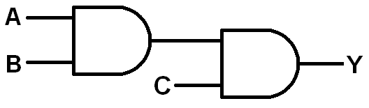  
   [[Image credit](https://learn.sparkfun.com/tutorials/logicblocks-experiment-guide/2-3-input-and-gate)]  
   
2. `[<lernact-prac>]`Prove that 8.2.1 can be extended to and AND gate with any number of inputs and one output.  

3. `[<lernact-prac>]`Build a 4-input AND gate out of NPN transistors and a load circuit, driven by micro:bit pins.  

4. `[<lernact-prac>]`**[Optional challenge, max 5 extra step points]** Write the minterm equation for the S output of the full adder, minimize it, and show a sketch of the minimal logic gates.

5. `[<lernact-prac>]`**[Optional challenge, max 10 extra step points]** Following the example for the half adder, construct a half `[<cept>]`_subtractor_. The outputs are D (for difference) and B<sub>OUT</sub> (for `[<cept>]`_borrow_-out).    

6. `[<lernact-prac>]`**[Optional challenge, max 15 extra step points]** Following the example for the full adder, construct a full subtractor. Note that instead of the carry-in input of the full adder, the full subtactor has a borrow-in input. 

#### 3. Present
[[toc](#table-of-contents)]

In the [programs](programs) directory:

1. Add your program from 8.2.3 with filename `microbit-program-8-2-3.js`.  

In the [Lab Notebook](README.md):

1. Show all your work for 8.2.1.  
2. Show all your work for 8.2.2.  
3. Link to the program from 8.2.3.  
4. Link to demo video showing the operation of the program from 8.2.3.  
5. Show all your work for 8.2.4.  
6. Show all your work for 8.2.5.  


### Step 9: Simulated logic gates
[[toc](#table-of-contents)]  

#### 1. Study
[[toc](#table-of-contents)]  

`[<lernact-rd>]`Logic gates come in chips we can use on the breadboard instead of building them out of transistors ourselves, but they would have made the lab kit expensive. Instead, we are going to simulate them on the micro:bit.

##### Booleans revisited
[[toc](#table-of-contents)]  

Let's recall what the `boolean` data type was: it contains a set of two different values `true` (aka logical 1) and `false` (aka logical 0). Because of the duality of the sets {`true`, `false`} and {1, 0}, we see that functions taking `boolean` arguments and returning a single `boolean` value are ideal to simulate logic gates with.

Let's see an example of the AND, OR, and NOT gates:
```javascript
// Example 9.2.1

function AND(a : boolean, b : boolean) : boolean {
    return a && b
}

function OR(a : boolean, b : boolean) : boolean {
    return a || b
}

function NOT(a : boolean) : boolean {
    return ! a
}
```
Notice that JavaScript already has `[<cept>]`_logical operators_ for these operations, namely `&&` for AND, `||` for OR, and `!` for NOT. Recall that we encountered `!` very early on when flipping icons!

Once we have these logic-gate functions, we can simulate any hardware device built out of logic gates. Let's practice on the XOR gate first. Recall that XOR returns 1 when exactly one of its inputs is 1. Let's review the truth table:
A | B | A XOR B
--- | --- | ---
0 | 0 | 0
0 | 1 | 1
1 | 0 | 1
1 | 1 | 0

A XOR B is 1 when either A is 1 or B is 1, **but not both** (in which it differs from regular OR). This can be expressed as A(NOT B) OR (NOT A)B. Now we can write this as a function, using our gate functions or directly with logical operators:
```javascript
// Example 9.2.2

function XOR(a : boolean, b : boolean) : boolean {
    return OR(AND(a, NOT(b)), AND(NOT(a), b))               // or, with operators, (a && !b) || (!a && b)
}
```

##### Order of operatins
[[toc](#table-of-contents)]  

Notice the order of operations we used in the functional implementation of XOR above. While the logical operators obey JavaScript's `[<cept>]`[_operator precedence_](https://developer.mozilla.org/en-US/docs/Web/JavaScript/Reference/Operators/Operator_Precedence), in particular `!` is applied before `&&` which is itself applied before `||`, there are not equivalent rules for our user-defined logic-gate simulation functions. Likewise, if we were to write the body of the XOR function with logical operators, we don't even need the brackets (which have the highest operator precedence) for correct evaluation, only for readability:
```javascript
// Example 9.2.3

function XOR(a : boolean, b : boolean) : boolean {
    return a && !b || !a && b
}
```
To achieve the same evaluation, we need to call our functions in the order the operators are applied. The first to be applied (which are the `NOT()` calls) are the most deeply nested, while the last to be evaluated (the `OR()` call) is on the outside, to get us the expression `OR(AND(a, NOT(b)), AND(NOT(a), b))`.  

##### Simulating connections    

In hardware, logic gates are connected to each other through wires. In our simulation, the connections are implicit in the nested calls of our simulation functions. The expression above can be shown as the follwing `[<cept>]`_signal-flow_ diagram:

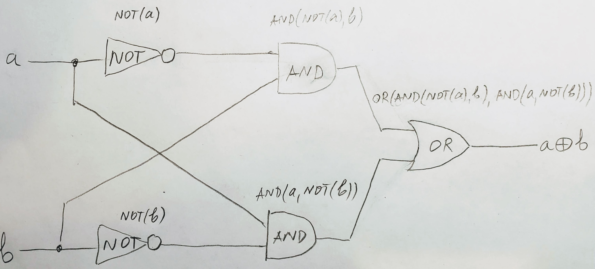  

##### Functionally complete sets
[[toc](#table-of-contents)]  

We just saw that one gate (XOR) can be designed out of other gates. How far can this go? It turns out that this can go quite far: there are several different sets of gates that can be used to design all remaining gates. These are called `[<cept>]`[_functionally complete sets_](https://en.wikipedia.org/wiki/Functional_completeness):
1. Any two gates of {AND, OR, NOT}.  
2. The NOR gate by itself, which is equivalent to an OR, followed by a NOT.    
3. The NAND gate by itself, which is equivalent to an AND, followed by a NOT.  

In fact, in hardware, all gates and other computing devices are built out of NAND or NOR gates.

**Question 9.1.1:** Why do you think this might be?  

#### 2. Apply
[[toc](#table-of-contents)]  

1. `[<lernact-prac>]`With simulated gates, the gate function is internal to the micro:bit. Modify the `logic` program from Example 7.1.1 to light an external LED when a simulated gate outputs `true` (or 1). Using Button A to cycle through the 4 functions, show:
   1. The simulated AND operating.  
   2. The simulated OR operating.  
   3. The simulated NOT operating.  
   4. The simulated XOR operating.  

2. `[<lernact-prac>]`Write a NOR() gate function out of the functional set {OR, NOT} and show its operation.  

3. `[<lernact-prac>]`Write a NAND() gate function out of the functional set {AND, NOT} and show its operation.  

4. `[<lernact-prac>]`Write alternative XOR() gate function as shown in the [Wikipedia article](https://en.wikipedia.org/wiki/XOR_gate#Alternatives) and show its operation.    

5. `[<lernact-prac>]`**[Optional challenge, max 3 extra step points]** Implement the AND() gate function using the functional set {OR, NOT} and show its operation. 

6. `[<lernact-prac>]`**[Optional challenge, max 5 extra step points]** Implement the AND() gate function using the functional set {NOR} and show its operation.  

7. `[<lernact-prac>]`**[Optional challenge, max 7 extra step points]** Implement the AND() gate function using the functional set {NAND} and show its operation.   

8. `[<lernact-prac>]`**[Optional challenge, max 10 extra step points]** Implement the NOR() gate function using the functional set {NAND} and show its operation.   
#### 3. Present
[[toc](#table-of-contents)]  

In the [programs](programs) directory:

1. Add your program from 9.2.1 with filename `microbit-program-9-2-1.js`.  
2. Add your program from 9.2.2 with filename `microbit-program-9-2-2.js`.  
3. Add your program from 9.2.3 with filename `microbit-program-9-2-3.js`.  
4. Add your program from 9.2.4 with filename `microbit-program-9-2-4.js`.  
5. Add your program from 9.2.5 with filename `microbit-program-9-2-5.js`.  
6. Add your program from 9.2.6 with filename `microbit-program-9-2-6.js`.  
7. Add your program from 9.2.7 with filename `microbit-program-9-2-7.js`.  
8. Add your program from 9.2.8 with filename `microbit-program-9-2-8.js`.  

In the [Lab Notebook](README.md):

1. Answer question 9.1.1.  
2. Link to the program from 9.2.1.  
3. Link to demo video showing the operation of the program from 9.2.1.  
4. Link to the program from 9.2.2.  
5. Link to demo video showing the operation of the program from 9.2.2.  
6. Link to the program from 9.2.3.  
7. Link to demo video showing the operation of the program from 9.2.3.  
8. Link to the program from 9.2.4.  
9. Link to demo video showing the operation of the program from 9.2.4.  
10. Link to the program from 9.2.5.  
11. Link to demo video showing the operation of the program from 9.2.5.  
12. Link to the program from 9.2.6.  
13. Link to demo video showing the operation of the program from 9.2.6.  
14. Link to the program from 9.2.7.  
15. Link to demo video showing the operation of the program from 9.2.7.  
16. Link to the program from 9.2.8.  
17. Link to demo video showing the operation of the program from 9.2.8.  


### Step 10: Full adder emulation
[[toc](#table-of-contents)]  

#### 1. Study
[[toc](#table-of-contents)]  

`[<lernact-rd>]`In this step we will build a full-adder emulator out of simulated gates. Here is a [demo video](https://msudenver.yuja.com/V/Video?v=2194276&node=8094867&a=289777574&autoplay=1) of our goal. And here is a program skeleton:
```javascript
// Example 10.1.1

function AND(a : boolean, b : boolean) : boolean {
    return a && b
}

function OR(a : boolean, b : boolean) : boolean {
    return a || b
}

function NOT(a : boolean) : boolean {
    return !a
}

function XOR(a : boolean, b : boolean) : boolean {
    return (a && !b) || (!a && b)
}

function half_adder(a : boolean, b : boolean) : boolean[] {
    return [AND(a, b), XOR(a, b)]
}

function full_adder(a : boolean, b : boolean, c_in : boolean) : boolean[] {

    // YOUR WORK HERE
    
    return null  // you need to change this
}


let abc_in : boolean[][] = [
    [false, false, false, false, true, true, true, true], // a    - column 0
    [false, false, true, true, false, false, true, true], // b    - column 1
    [false, true, false, true, false, true, false, true], // c_in - column 2
]

let brightness : number[] = [5, 255]

function verifier(c_out : DigitalPin, s : DigitalPin) : void {
    for (let y=0; y<abc_in[0].length; y++) {
    
        // YOUR WORK HERE
    
    }
    // for repeating forever
    basic.clearScreen()
}

forever(function () {
    verifier(DigitalPin.P11, DigitalPin.P15)    
})
```
Note the following:
1. The adders return arrays of the form `[C, S]`.  
2. `abc_in` is a 2-D array containing the input combinations.  
3. You are given all the gate functions and can use them in your implementation.  

#### 2. Apply
[[toc](#table-of-contents)]  

1. `[<lernact-prac>]`Implement a static table-based (that is, without computation) full adder.  

2. `[<lernact-prac>]`**[Optional challenge, max 10 extra step points]** Implement the full adder with simulated gates.  

#### 3. Present
[[toc](#table-of-contents)]  

In the [programs](programs) directory:

1. Add your program from 10.2.1 with filename `microbit-program-10-2-1.js`.  
2. Add your program from 10.2.2 with filename `microbit-program-10-2-2.js`.  

In the [Lab Notebook](README.md):

1. Link to the program from 10.2.1.  
2. Link to demo video showing the operation of the program from 10.2.1.  
3. Link to the program from 10.2.2.  
4. Link to demo video showing the operation of the program from 10.2.2.  


### Step 11: ALU bit slice
[[toc](#table-of-contents)]  

#### 1. Study
[[toc](#table-of-contents)]  

`[<lernact-rd>]`At the heart of every modern processor there is a device that performs all the arithmetic and logic functions and is, naturally, called the `[<cept>]`_arithmetic-logic unit (ALU)_. The ALU is also built out of gates. More specifically, each bit position has its own independent circuit, called a `[<cept>]`_bit slice_. In this section we will study the following bit slice:

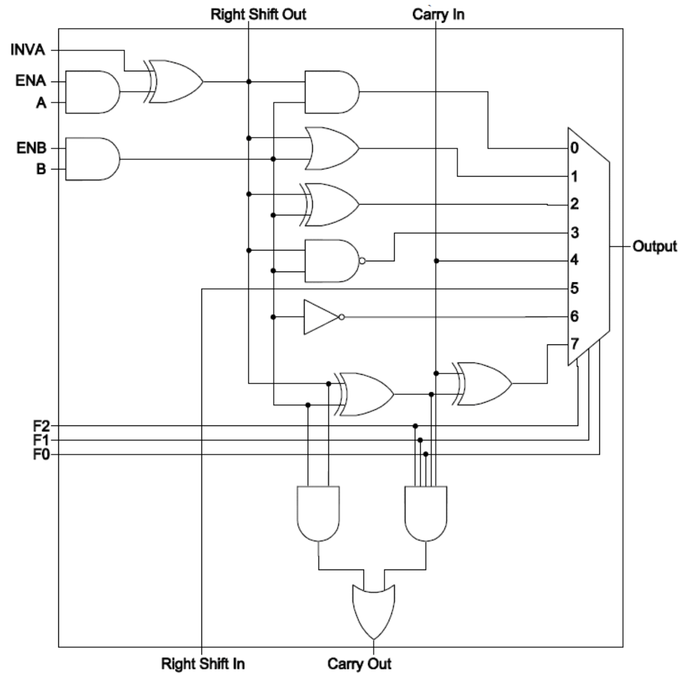

Note that when two lines cross _without a dot_, there is **no** electrical connection.  

##### I/O
[[toc](#table-of-contents)]  

The ALU bit slice has the following inputs:
1. A and B operands.  
2. Carry In from the slice at the previous position.  
3. Function selection lines (aka `[<cept>]`_bus_).  
4. Operand control lines.  
5. Right shift in from the slice at the next position, if any.  

The ALU bit slice has the following outputs:
1. The output result.  
2. Carry out to the slice at the next position.  
3. Right shift out to the slice at the previous position.  

##### Function selection
[[toc](#table-of-contents)]  

The ALU bit slice can execute 8 different functions, selected by the 3 control lines F<sub>2</sub>, F<sub>1</sub>, F<sub>0</sub>.

**Question 11.1.1:** Why can 3 lines select 1 of 8 functions?  
**Question 11.1.2:** Notice the **Carry Out** output at the bottom and the 5-input AND gate nearby. What is the value of the function lines that selects addition?    
**Question 11.1.3:** A shift function can only be applied to one operand at a time. Take a look at the **Right Shift Out** output at the top. Which of the two operands A and B can be right-shifted?  

##### Control lines
[[toc](#table-of-contents)]  

The control lines of the ALU slice are:
1. ENA enables the A input.  
2. ENB enables the B input.  
3. INVA inverts the A input.  

**Question 11.1.4:** Why are the enable lines connected to AND gates with their controlled inputs?  
**Question 11.1.5:** Why is the invert line connected to an XOR gate with its controlled input?  

#### 2. Apply
[[toc](#table-of-contents)]  

1. `[<lernact-prac>]`Trace and highlight the active (meaning carrying signals of interest) lines for the NOT function in the bit-slice diagram.  

2. `[<lernact-prac>]`Put 4 bit slices next to each other and connect them to form a 4-bit ALU. Answer the following questions:
   1. How many control lines do you have in total, and what are they? (Make sure they are properly connected in your diagram.)  
   2. How many data lines do you have in total, and what are they? (Make sure they are properly connected in your diagram.)  

3. `[<lernact-prac>]`**[Optional challenge, max 10 extra step points]** ALUs usually include comparison functions as well. They might or might not be performed inside the slices. Read this [post](https://www.electronics-tutorials.ws/combination/comb_8.html) on building a digital comparator. Modify the ALU bit-slice design from the diagram by removing the XOR function and substituting a LESS function instead.  

4. `[<lernact-prac>]`**[Optional challenge, max 5 extra step points]** The same as 11.2.3 without adding any gates, so that, with the removal of the XOR gate, the new bit slice has _one gate less_.  

#### 3. Present
[[toc](#table-of-contents)]  

In the [Lab Notebook](README.md) and [images](images) directory:

1. Answer question 11.1.1.  
2. Answer question 11.1.2.  
3. Answer question 11.1.3.  
4. Answer question 11.1.4.  
5. Answer question 11.1.5.  
6. Show your work for 11.2.1 in well-formatted Markdown, including whatever images, tables, or other graphical elements you find necessary.  
7. Answer question 11.2.2.1.  
8. Answer question 11.2.2.2.  
9. Show your work for 11.2.2 in well-formatted Markdown, including whatever images, tables, or other graphical elements you find necessary.  
10. Show your work for 11.2.3 in well-formatted Markdown, including whatever images, tables, or other graphical elements you find necessary.  
11. Show your work for 11.2.4 in well-formatted Markdown, including whatever images, tables, or other graphical elements you find necessary.  


### Step 12: Emulated 4-bit ALU
[[toc](#table-of-contents)]  

#### 1. Study
[[toc](#table-of-contents)]  

`[<lernact-rc>]`The ALU is composed out of ALU bit slices. There is a bit slice for each one of the number of bits the processor word. In this step, we will build a 4-bit ALU.  

##### Stacking bit slices

The first step in creating a multi-bit ALU out of bit slices, is to stack the requisite number of bit slices, as shown in the following image for a 4-bit ALU:

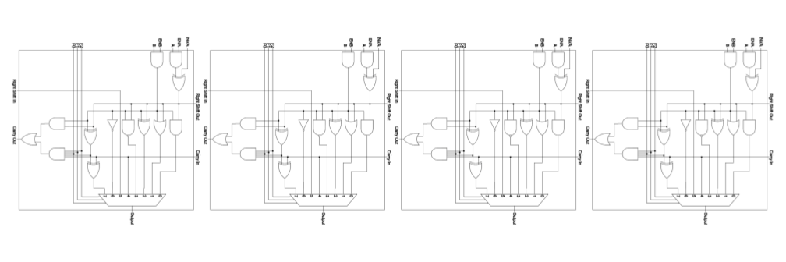

##### 2s complement

The ALU we are building includes support for 2s-complement signed integer addition. You may ask how we can convert a number to its 2s-complement if we have a subtaction operation? The conversion added two more operations, namely flipping the bits and adding 1. This had to be done before we could perform the addition and get a silent overflow. The answer is that the signed integers are converted long before they make it to the ALU, so it can just perform the addition, as it works the same for any combination of operand signs. Signed integers are stored in memory in 2s-complement format. There is no conversion happening inside the ALU, which has to be as fast as possible. 

##### Overflow

One thing that we need to take care of to have a 4-bit ALU is to construct an overflow circuit (aka `[<cept>]`_overflow guard_). There are two types of overflow that happen during addition:
1. Silend overflow, which we saw when we had operands with opposite signs (remember 13<sub>10</sub> - 7<sub>10</sub>).  
2. Regular overflow, namely arriving at a result with larger magnitude than can be represented, may happen when the operands are with the _same sign_, either both positive or both negative. Regular overflow never happens when the signs of the operands are different. Regular overflow can be detected when _the sign of the result is opposite of that of the operands_. Here is a succinct [overview of binary arithmetic](https://www.doc.ic.ac.uk/~eedwards/compsys/arithmetic/index.html).  

#### 2. Apply
[[toc](#table-of-contents)]  

1. `[<lernact-prac>]`Implement an emulator of a full adder for 4-bit unsigned integers. Requirements:
   1. Use the emulated full-adder bit slice from a previous step as a unit.  
   2. Build 5 external LED circuits to show the result, including overflow. Consider the leftmost LED bit position as an `[<cept>]`_overlfow flag_.    
   3. Pick operand `a` on the micro:bit screen.  
   4. Pick operand `b` on the micro:bit screen.  
   5. Show the result on the external LEDs.  

2. `[<lernact-prac>]`**[Optional challenge, max 5 extra step points]** Implement an emulator of a full adder for 4-bit 2s-complement signed integers. Apart from an extension of the full-adder slice, the requirements are the same as in 12.2.1. _Hint: Consider preprocessing the operands before doing the final addition._  

3. `[<lernact-prac>]`**[Optional challenge, max 10 extra step points]** Implement an emulated ALU bit slice, based on simulated logic gates, with the following functions, and the necessary control lines:
   1. Logical AND.  
   2. Logical OR.  
   3. Logical NOT.  
   4. Logical XOR.  
   5. 2s-complement binary addition.  
   6. Left shift by 1 bit at a time.  
   7. Right shift by 1 bit at a time.  
   8. **[Additional challenge, max 3 extra step points]** An 8-th function of your choice (e.g. NAND).    
   
4. `[<lernact-prac>]`**[Optional challenge, max 10 extra step points]** Implement an emulator of a 4-bit ALU using the bit slice from the previous exercise as a unit. The rest of the requirements are the same as in 12.2.1.  

#### 3. Present
[[toc](#table-of-contents)]  

In the [programs](programs) directory:

1. Add your program from 12.2.1 with filename `microbit-program-12-2-1.js`.  
2. Add your program from 12.2.2 with filename `microbit-program-12-2-2.js`.  
3. Add your program from 12.2.3 with filename `microbit-program-12-2-3.js`.  
4. Add your program from 12.2.4 with filename `microbit-program-12-2-4.js`.  

In the [Lab Notebook](README.md):

1. Link to the program from 12.2.1.  
2. Link to a demo video of the operation of the program from 12.2.1.  
3. Link to the program from 12.2.2.  
4. Link to a demo video of the operation of the program from 12.2.2.  
5. Link to the program from 12.2.3.  
6. Link to a demo video of the operation of the program from 12.2.3.  
7. Link to the program from 12.2.4.  
8. Link to a demo video of the operation of the program from 12.2.4.  
