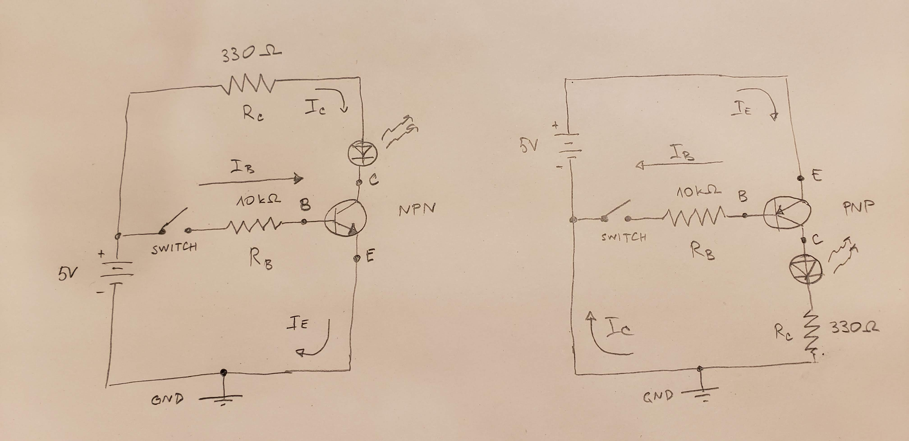
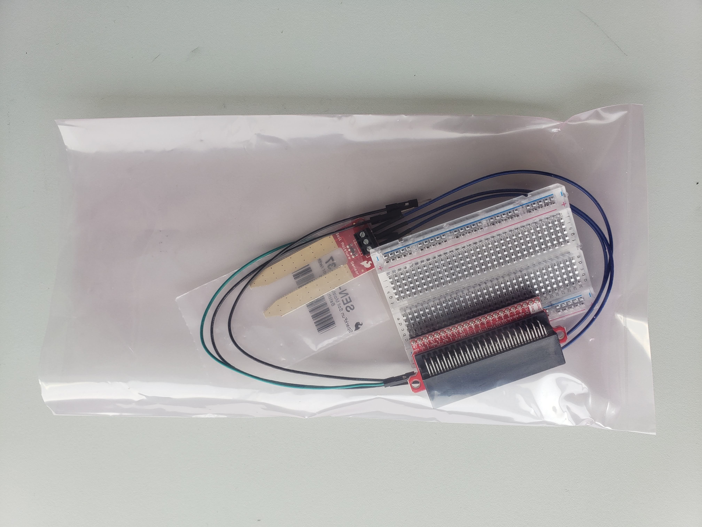
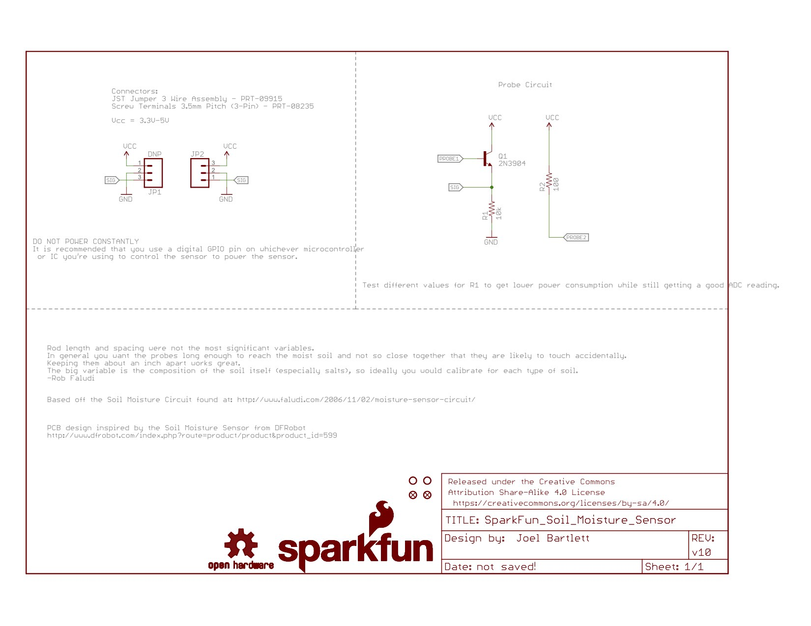

# CPE 1040 - Spring 2020

## Assignment 5: Transistors

Author: Ivo Georgiev, PhD  
Last updated: 2020-02-23  
Code: 98ffb5e9c5964e27028001933faec10caa0e4709  

This is assignment 5 for the Spring 2020 installment of the CPE 1040 - Intro to Computer Engineering course at MSU Denver.

### Overview

This assignment introduces transistors and electrical circuits that employ them. _Refer to the [requirements](requirements.md) for this assignment. Filling out the [README](README.md) for this repository is part of the assignment. Treat the README as your lab notebook. Refer to the [criteria](criteria.md) for submitted assignments!_

#### Requirements

##### 1. NPN transistor circuit

1. Pick a [2N3904](https://www.sparkfun.com/datasheets/Components/2N3904.pdf) transistor and build the npn circuit on the left. 
2. For a switch, use one of the workstation switches on the left of the breadboard area. Make sure they are in the CMOS (that is 5V) mode. _Hint: The switch is already connected to 5V and 0V and toggles between them. You only need to bring a wire from it to the base resistor._
3. With the switch off, measure the voltages:
   1. Accross the resistor RC.
   2. At the collector (C).
   3. At the base (B).
   4. At the emitter (E).
   5. Record these voltages in the README.
4. With the switch off, measure the currents:
   1. The collector current IC.
   2. The emitter current IE.
   3. The base current IB. _If this current is not zero, you are doing something wrong :)_
   4. Record these currents in the README. Does any current flow?
5. Turn the switch on and repeat the measurements in (3) and (4), recording them in the README.
6. What can you say about the relationship among the three currents IC, IE, and IB?
7. The npn transistor is a _current amplifier_. What is the amplification coefficient in your circtuit? _Hint: Consider the ratio IC/IB._
7. Now that you are familiar with the curcuit, close everything and draw it. Take a picture and embed your drawing in your README writeup.

##### 2. PNP transistor circuit

1. Pick a [2N3906](https://www.sparkfun.com/datasheets/Components/2N3906.pdf) transistor and build the circuit on the right. _Does the LED light up when the switch is on or off? Explain._
2. Repeat all the measurements from part (1) with the pnp circuit, and include in the README writeup.
3. Answer the current questions from part (1), with the pnp circuit, and include in the README writeup.
4. Make a non-aided drawing for the pnp curcuit and embed in the README.

_**Note:** The soil sensor comes pre-wired, so no soldering is required._

##### 3. Soil sensor

###### Introduction

The soil moisture sensor is a transistor-based device to measure the moisture of soil based on the resistance between two prongs. The more water in the soil, the less resistance. The sensor has 3 wires for **Vcc**, **GND**, and **SIG** (for SIGnal). The high voltage and ground have to be supplied by the operating circuit. **Vcc** is supplied using the micro:bit [`digitalPinWrite`](https://makecode.microbit.org/reference/pins/digital-write-pin) function. **GND** is supplied by the micro:bit **GND** pin. **SIG** is read using the micro:bit [`analogReadPin`](https://makecode.microbit.org/reference/pins/analog-read-pin). _It is up to you to configure the pins correctly so that you don't disable or interfere with the micro:bit 25 LED matrix._ Skim read the [soil sensor hookup guide](https://learn.sparkfun.com/tutorials/soil-moisture-sensor-hookup-guide) to familiarize yourself with the device.

###### Sensor care

> 1. **Do not hook up the VCC on the sensor to a constant 3.3V or leave the digital pin to 1 when you are not taking a reading. This degrades the sensor quickly!**
> 2. **Do not immerse the whole sensor in water!**

###### Requirements

1. Based on your understanding of the operation of transistors from the previous sections, look at the schematic of the soil sensor circuit and describe its operation in the README.
2. How will you measure the _resistance_ of full-soaked soil? Give an explanation, take and embed an image of your setup, and record in the README your measured values for _fully dry soil_ RDRY, _somewhat wet soil_ RWET, and _fully soaked soil_ RSOAK.
3. How will you measure the _base voltage_ VB of the sensor transistor? Give an explanation, take and embed an image of your setup, and record in the README your measured values for _fully dry soil_ VBDRY, _somewhat wet soil_ VBWET, and _fully soaked soil_ VBSOAK.
1. Keeping at least one analog output pin, open a digital input pin and hook it up to a TTL input button on the workstation. Light the external LED when you detect a 1 on the input button (that is, the button is _pressed_). _Note: Do you need an external or internal [pullup resistor](https://www.google.com/search?q=pullup+pulldown+resistor&oq=pullup+pull)?_ Commit the JavaScript file to your assignment repository, calling it `digital-in.js`. Build the circuit and take a short video of its operation. Do a short writeup in [README.md](README.md) and include a link to the video.
2. Hook up the soil moisture sensor. There are three wires coming out: VCC, GND, and SIG. Pick a GPIO pin, configure it as digital output, and wire VCC to it. Pick a GPIO pin, configure it as analog in, and wire SIG to it. GND whould be wired to ground on the micro:bit.
3. Write a program that:
   1. Reads the sensor input in a loop with pauses to get the reading.
   2. It only powers the sensor when it takes a reading, by writing a 1 and then a 0 to the digital output pin. 
   3. Maps the range of input values of the sensor (you need to measure them yourself) to the range 0-4. Use the [`map`](https://makecode.microbit.org/reference/pins/map) function. This is called _calibration_ of the sensor. For the minimum value, take a reading with a dry sensor not touching anything; for the maximum value, take a reading with the sensor prongs dipped in shallow water. **Do not immerse the whole sensor in water!**
   4. When it takes a sensor reading, it lights up as many rows of the LED matrix as correspond to the rescaled magnitude of the reading.
4. Commit the JavaScript file to your assignment repository, calling it `manual-calibration.js`. Build the circuit and take a short video of its operation. Do a short writeup in [README.md](README.md) and include a link to the video.

##### 4. Automatic calibration
   
1. Write a program that does the calibration programmatically:
   1. When the program starts, it prompts the user to take three readings of the low and three readings of the high values of the range. It starts by showing the South icon image to prompt the user to take a low value, and records it. Then, it shows the North icon image to prompt the user to take a high value, and records it. It repeats this two more times, for a total of 3 readings for each.
   2. It takes the average of the low values and sets the range minimum to that value. It does the same for the range maximum.
   3. It performs the mapping, exits the calibration subprogram, scrolls "Calibration success" once, and starts normal operation described in the previous task.
2. Commit the JavaScript file to your assignment repository, calling it `auto-calibration.js`. Build the circuit and take a short video of its operation. Do a short writeup in [README.md](README.md) and include a link to the video.   

##### 5. Project extensions

1. **(BONUS)** Modify your soil sensor circuit and measurement and calibration program to show the moisture level on 5 external LEDs of different colors. _It's up to you how you order them, as long as you have a good explanation for the order._ As with the other sections, do a short writeup and embed a demo video of your circuit operating in the README.
2. **(BONUS)** Modify your soil sensor circuit and measurement and calibration program to show the moisture level on 2 external LEDs of different colors. Specifically, you should use 4 levels of brightness on the _yellow_ LED, employing the microbit PWM functions [`servoWritePin`](https://makecode.microbit.org/reference/pins/servo-write-pin) and [`servoSetPulse`](https://makecode.microbit.org/reference/pins/servo-set-pulse), and the highest moisture level on the green LED of high brightness. _It's up to you to chose the right function and calibrate the pulse widths to show 4 levels._ As with the other sections, do a short writeup and embed a demo video of your circuit operating in the README.

## Resources

### micro:bit 

1. [micro:bit lessons](https://makecode.microbit.org/lessons).
2. [micro:bit ideas](https://microbit.org/ideas/).
3. A list of some more [advanced projects](https://www.itpro.co.uk/desktop-hardware/26289/13-top-bbc-micro-bit-projects).
4. The [projects](https://github.com/carlosperate/awesome-microbit#%EF%B8%8F-projects) at the [awesome micro:bit list](https://github.com/carlosperate/awesome-microbit).
5. micro:bit [technical documentation](https://tech.microbit.org/).
6. micro:bit [reference](https://makecode.microbit.org/reference/), and [pins](https://makecode.microbit.org/reference/pins/servo-set-pulse), specifically.

### Transistors
1. Video of [transistor operation](https://www.youtube.com/watch?v=7ukDKVHnac4)
2. Video of [PN diode operation](https://www.youtube.com/watch?v=-SSkjWuUri4)
3. Video of [NPN and PNP transistor operation](https://www.youtube.com/watch?v=R0Uy4EL4xWs)
4. Video of [NPN vs. PNP Transistors as Common-Emitter Switches](https://www.youtube.com/watch?v=kNVaIqmKUoI)
5. Video of [MOSFET operation](https://www.youtube.com/watch?v=stM8dgcY1CA)

#### Datasheets

1. NPN transistor [2N3904 datasheet](https://www.sparkfun.com/datasheets/Components/2N3904.pdf)
2. PNP Transistor [2N3906 datasheet](https://www.sparkfun.com/datasheets/Components/2N3906.pdf)

### Sensors

1. SparkFun soil moisture sensor [hookup guide](https://learn.sparkfun.com/tutorials/soil-moisture-sensor-hookup-guide). _Note: The guide is for Arduino, not micro:bit, but that does not affect the operation of the sensor See the intro item in the [soil sensor section above](#soil-sensor)._

### Github

1. Github Tutorial for Beginners ([webpage](https://product.hubspot.com/blog/git-and-github-tutorial-for-beginners)).
2. Github Basics for Mac and Windows ([video](https://www.youtube.com/watch?v=0fKg7e37bQE)).
3. git & Github Crash Course for Beginners ([video](https://www.youtube.com/watch?v=SWYqp7iY_Tc)).
4. Introduction to Github for Beginners ([video](https://www.youtube.com/watch?v=fQLK8Ib_SKk)).
5. About `git` ([webpage](https://git-scm.com/about)).
6. `git` [documentation](https://git-scm.com/doc) (webpage, book, videos, reference manual).
7. [Github markdown cheat sheet](https://github.com/adam-p/markdown-here/wiki/Markdown-Cheatsheet).

### JavaScript

1. Technically, the language which is used side-by-side with Blocks in the Makecode ronment is a subset of [TypeScript](https://makecode.com/language), which itself is a superset of JavaScript (technically, [ECMAScript](https://www.ecma-international.org/ecma-262/10.0/index.html#Title)), with some JS features not implemented in Makecode.
2. The limited [JavaScript mini-tutorial](https://makecode.microbit.org/javascript) in Makecode.
3. Official [TypeScript documentation](https://www.typescriptlang.org/docs/home.html):
   1. TypeScript in 5 min [tutorial](https://www.typescriptlang.org/docs/handbook/typescript-in-5-minutes.html). _Note: You will need to [download](https://www.typescriptlang.org/index.html#download-links) and install an integrated development environment (IDE). The two that I recommend are Visual Studio Code from Microsoft and WebStorm from JetBrains._
   2. The full documentation and reference is under _Handbook_. Bear in mind that you are drinking from the hose. Don't be surprised if not everything is presented in a strictly incremental manner.
4. In-browser TypeScript [playground](https://www.typescriptlang.org/play/index.html). Note that micro:bit specific code will not run, but you can still play. _Start making the distinction between a generic multi-purpose programming language (TypeScript) and functionality (packages, libraries, objects, etc.) that is specific to a particular device (micro:bit), though written in the same programming language._
5. A pretty good and very palatable JS tutorial with in-browser coding, by [Codecademy](https://www.codecademy.com/learn/introduction-to-javascript).

6. Extensive and detailed [JS tutorial](https://javascript.info/), with some advanced material thrown in. **I like this one!**

7. The most authoritative JS resource on the Web, including tutorials and reference, by [Mozilla](https://developer.mozilla.org/en-US/docs/Web/JavaScript).

